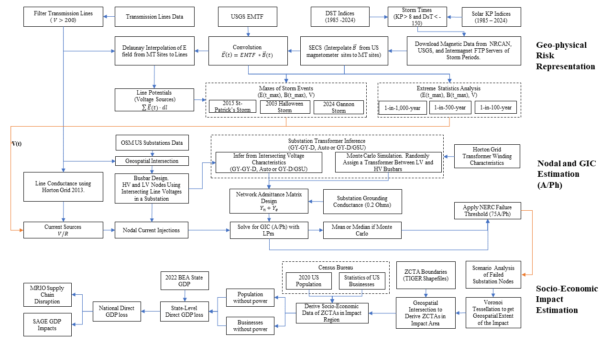

# Statistical Analysis Workflow

This documentation outlines the step-by-step process for running statistical analysis on geomagnetic data and its impact. The figure below is a box diagram of the method.


## Dataset Setup

1. Download data archive:

   ```bash
   wget [https://zenodo.org/records/14231083/files/data_loc.tar.gz?download=1]/data_loc.tar.gz
   ```

2. Extract and rename:

   ```bash
   tar -xzf data_loc.tar.gz && mv data_loc data
   ```

3. Required datasets:
   ```
   data/
   ├── EMTF/
   │   └── mt_pickle.pkl              # MT sites data
   ├── kp_ap_indices/
   │   └── storm_periods.csv          # Storm time data
   ├── Electric__Power_Transmission_Lines/
   │   └── trans_lines_pickle.pkl     # Transmission lines data
   ├── econ_data/
   │   └── winding_mean_df.csv        # Economic impact data (computed in the impact notebook)
   ├── maxB_arr_testing_2.npy         # Maximum B values
   ├── maxE_arr_testing_2.npy         # Maximum E values
   ├── maxV_arr_testing_2.npy         # Maximum V values
   ├── processed_geomag_data.nc       # Processed geomagnetic data
   ├── grid_e_*.pkl                   # Grid and mask data for plotting
   ├── nerc_gdf.geojson              # NERC regions data
   ├── final_tl_data.pkl             # Final transmission line data
   ├── line_coords.pkl               # Line coordinates
   └── various auxiliary files        # & more pupporting datasets
   ```

## Initial Setup

Before beginning (if you wish to generate the datafiles by yourself), ensure all requirements are met by following the detailed setup instructions in `/data_routines/README.md`. This setup is crucial for proper data processing and analysis. Also, this workflow is designed to manage memory efficiently by processing data sequentially across multiple scripts.

## Detailed Workflow

### 1. Calculate Storm Maximums

**Script**: `calculate_storm_maxes.py`

[Rest of your documentation...]

## Detailed Workflow

### 1. Calculate Storm Maximums

Download the necessary data from zenodo at [Zenodo]()
**Script**: `calculate_storm_maxes.py`

This script calculates maximum values for three key parameters at magnetotelluric sites and transmission lines:

- Magnetic field strength (B)
- Electric field strength (E)
- Voltage (V)

**Prerequisites**:

- Processed geomagnetic data files
- EMTF (Electromagnetic Transfer Function) files
- Transmission lines dataset
- Run `/data_routines/process_tl_sub.py` first to generate the necessary transmission and substation files

**Output**:

- HDF5 file containing:
  - Geoelectric field measurements
  - Magnetic field measurements
  - Voltage source data

### 2. Statistical Analysis

**Script**: `statistical_analysis.py`

This step focuses on generating extreme value statistics from the maximum values calculated in step 1:

- Applies power-law fitting to the maximum values
- Analyzes statistical distributions
- Generates probability models for extreme events

### 3. Build Admittance Matrix

**Script**: `build_admittance_matrix.py`

Creates a comprehensive geospatial network model:

- Intersects transmission lines with substation data
- Generates a connectivity network across the United States
- Implements transformer assumptions as detailed in Case 1 methodology
- Creates a detailed network topology for subsequent analysis

### 4. GIC Estimation

**Script**: `estimate_GIC.py`

Performs detailed Geomagnetically Induced Current (GIC) analysis:

- Generates 2000 distinct scenarios for transformer network analysis
- Implements the Lehtinen-Pirjola method to calculate:
  - Nodal voltages
  - GIC through transformer windings
  - Ground node current flows
- Uses Cholesky decomposition for sparse matrix solutions
  - CUDA acceleration is recommended for optimal performance
- Outputs individual CSV files for each analyzed substation transformer

### 5. Socioeconomic Impact Analysis

**Location**: `data/econ_data` notebook

This final step analyzes the broader economic implications:

- Utilizes preprocessed data from:
  - Bureau of Economic Analysis (BEA)
  - Census Bureau
  - Statistics of U.S. Business
- Integrates GIC impact data with economic indicators
- Available via [spwio]() repository

## Notes

- Each script generates data that serves as input for subsequent scripts.
- This sequential approach prevents memory saturation.
- Ensure all prerequisite data is properly processed before running each step.
- CUDA capability is required for efficient processing in step 4 (Will include default to CPU).
